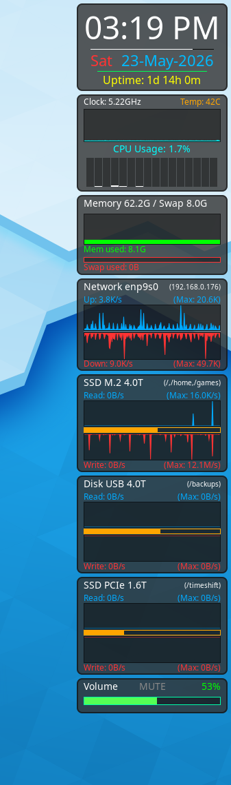

# Tom's EWW System Monitor

Clean, modular, and well-documented system monitoring widgets for **EWW** (Elkowar's Wacky Widgets).

 <!-- Add a nice screenshot here -->

A focused, lightweight system monitor bar built with EWW...

## Features

### Clock
- Time (AM/PM format) with timezone on hover
- Live seconds progress bar
- Date (click to open monthly calendar in browser)
- System uptime
- A UTC clock is provided, uncomment in eww.yuck to see

### CPU
- Current clock speed
- CPU Temperature (configurable sensor)
- Usage history graph (hover for CPU model)
- CPU Usage text (hover for Optimal CPU vertical bar width)
- Per-core vertical usage bars

### Memory & Swap
- Total memory and swap sizes
- Memory usage graph (hover to see percent used)
- Swap usage bar (hover to see percent used)

### Network
- Network device name + current IP
- Upload and Download graphs with live max tracking

### Disks (Multi-disk support)
- Drive title and mount point (click to open in file manager)
- Read/Write speed graphs with automatic max scaling
- Usage percentage bar (hover to see percent used)

### Volume
- Mute toggle button
- Current volume percentage
- Click to set volume + scroll wheel support (PipeWire)

---

## Installation

1. **Compile EWW** (no official binaries yet):
   ```bash
   git clone https://github.com/elkowar/eww
   cd eww
   cargo build --release
   sudo install target/release/eww /usr/local/bin/
   ```

2. Install dependencies:
   ```bash
   sudo dnf install lua pipewire wireplumber   # Fedora
   # or
   sudo apt install lua pipewire wireplumber   # Ubuntu/Debian
   ```

3. Clone or download this repo into `~/.config/eww/` like the File Structure section below.
   ```bash
   cd ~/.config/eww/
   git clone https://github.com/tomgonz/tom-eww-sys-mon  .
   ```

4. Start or restart the widgets.  Add this to your login autostart.
   ```bash
   ~/.config/eww/launch_eww.sh
   ```

---

## Quick Commands

```bash
eww daemon           # Start EWW daemon
eww open sys-mon     # Open the system monitor
eww kill             # Close everything
eww state            # Show all current variables
eww reload           # Reload config (shows errors)
eww logs             # show logs from startup
```

---

## Configuration

Most important settings are near the top of `eww.yuck`.

| Setting                  | File         | Description |
|-------------------------|--------------|-----------|
| Position on screen      | `eww.yuck`   | Change `:anchor`, `:x`, `:y` |
| Timezone                | `eww.yuck`   | `defvar timezone` |
| CPU Temp Sensor         | `eww.yuck`   | `defvar cpu_temp_sensor` (run `eww get EWW_TEMPS` to find yours) |
| Network Device          | `eww.yuck`   | `defvar net_dev` |
| Widget/Graph Width      | `eww.yuck`   | Keep `widget_width = graph_width + margin_width` |
| CPU Vertical Bar Width  | `eww.yuck` + `eww.scss` | `cpu_bar_width` |

**Adding more disks**: Edit both `eww.yuck` and `scripts/disk-net-max.lua`.

---

## File Structure

```
~/.config/eww/
├── README.md
├── launch_eww.sh
├── eww.scss
├── eww.yuck
├── scripts/
│   ├── disk-net-max.lua
│   ├── get_ip.sh
│   ├── set_volume.sh
│   └── toggle_mute.sh
└── widgets/
    ├── clock/
    |   ├── clock.scss
    |   ├── clock.yuck
    |   └── clock-utc.yuck
    ├── cpu/
    |   ├── cpu.scss
    |   └── cpu.yuck
    ├── disk/
    |   ├── disk.scss
    |   └── disk.yuck
    ├── mem/
    |   ├── mem.scss
    |   └── mdm.yuck
    ├── net/
    |   ├── net.scss
    |   └── net.yuck
    └── volume/
        ├── volume.scss
        └── volume.yuck
```

---

## Dependencies & Accessed Files

**Commands used:**
- `awk`, `basename`, `cut`, `df`, `grep`, `ip`, `lua`, `wpctl`, `eww`

**Files accessed:**
- `/proc/cpuinfo`, `/proc/diskstats`, `/proc/uptime`

---

## Notes

- Designed for personal desktop use (Hyprland, etc.)
- Uses `fg` stacking by default (widgets stay above other windows)
- Lua script automatically adjusts graph history length based on `graph_width`

---

## License

GPL v3.0

---
